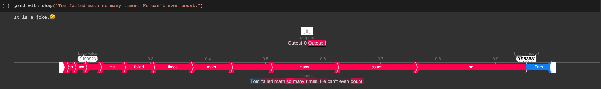
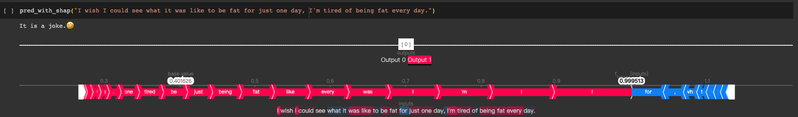
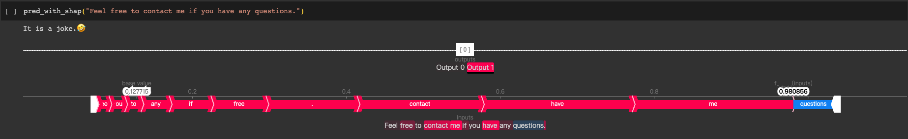

# Anatomy of Jokes
`Explaining a joke is like dissecting a frog. You understand it better but the frog dies in the process.🐸`

This project aimed at creating a joke detection model by fine-tuning an existing language model using `LoRA`, and applying `SHAP` for detection explanation to identify the punch words in jokes. 

The entire project was completed in Google Colab to take advantage of the free GPU resources provided by the platform. For optimal display of the detection explanation results, it is recommended to open [the notebook in Colab](https://colab.research.google.com/github/terry-chongkalok/anatomy_of_joke/blob/main/Anatomy_of_Jokes.ipynb).

- Data Source: Dataset from Github Repository: [ColBERT-Using-BERT-Sentence-Embedding-for-Humor-Detection](https://github.com/Moradnejad/ColBERT-Using-BERT-Sentence-Embedding-for-Humor-Detection)
- Base model: [distilroberta-base ](https://huggingface.co/distilroberta-base)
- Model Evauation after fine-tuning:
    - Accuracy: **`0.98`**
    - F1 Score: **`0.98`**

## Observations on Detection Explanations

In most cases the SHAP Explainer successfully identified the punch words in jokes with a positive contribution to the joke detection.

However, the explanation results also revealed that there is still room for improvement in the detection model:

1. The contribution of the punch words to the classification score was not always the largest compared to other words in the jokes.

2. Pronouns like "I" and "me" often had high contributions to joke detection, which sometimes led to false positive detections, as seen in the example below.

3. When comparing the base values for sentences of different lengths, it was observed that the detection model generally predicted a higher probability for longer sentences, which suggests a possible bias.

## Data-centric Ideas for Future Project Enhancement

1. Collect more diverse data from different sources, eg including more non joke text containing pronouns, longer non joke text, or shorter joke text.

2. Create negative sample data by changing the punch words in a joke to make it unfunny, which would help the model and SHAP explainer better understand the importance of the punch words. (This can be done on a large scale with the help of ChatGPT.)
